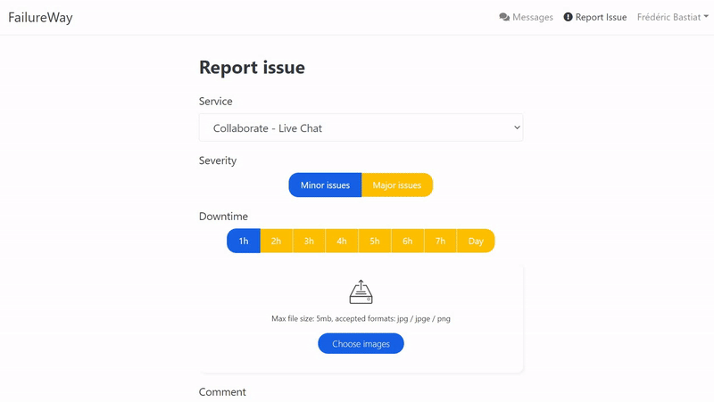
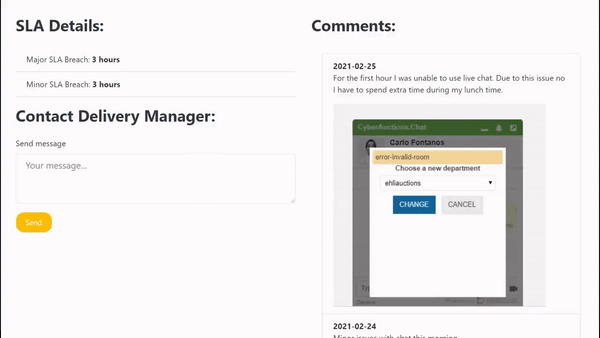
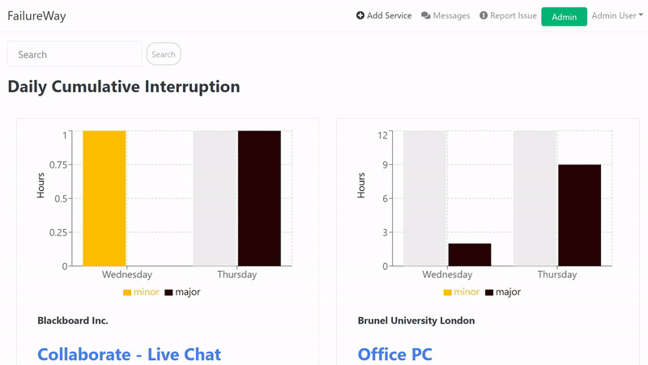

# FailureWay
FailureWay is a downtime reporting platform built in MERN stack set for Heroku deployment. Make better decisions using a data driven approach.

EMAIL: dummy@account.com

PASSWORD: 123456

### Working DEMO: 
[Please allow up to 1 minute for the page to initially load.]

Europe: https://europe-failureway.herokuapp.com/login

USA: https://failureway.herokuapp.com/login

## Table of contents
* [Introduction](#Introduction)
* [Features](#Features)

## Introduction
How to run this project?

First you will need to create your own **.env** file (just an empty file in the root directory with .env extension) with following variables:

**NODE_ENV** = production

**PORT** = 5000

**MONGO_URI** = [here you will need to give your MongoDB Atlas url]

**JWT_SECRET** = [Some secret. This can be anything "abcde123" is just fine]

```
cd /frontend
```
```
npm install
```
This will install all dependencies for the React frontend.
```
cd ..
```
```
npm install
```
This will install all dependencies for ExpressJS backend.

```
npm run dev
```

[Optional]
If you have heroku setup: 
```
git push heroku master 
```

## Features
This are the already implemented features.

### Dashboard
This is the main page that shows every service.


## 

### Report
Report screen allowes to upload photos up to 5MB (In format: jpg, png) and a comment.


## 

### Messenger
Simple messaging tool


## 

### Create Service [Admin]
Admin tool adding new services

